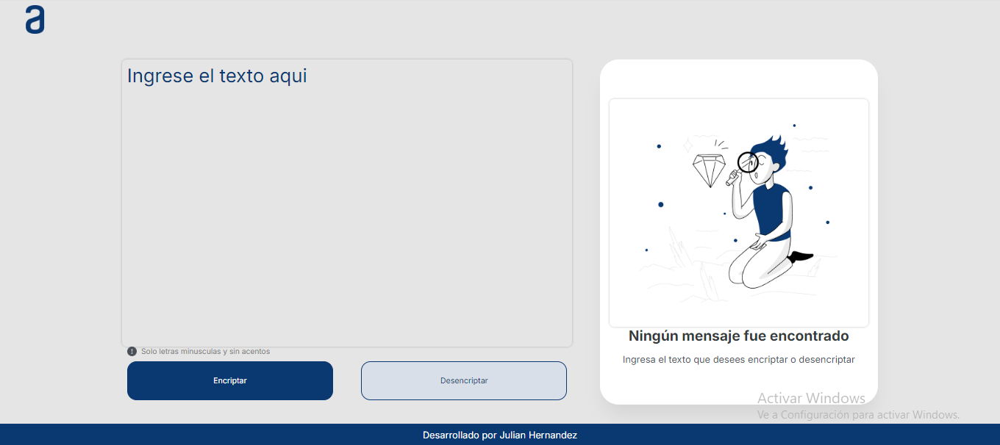

Challenge encriptador de texto
El desafío consiste en construir una página web que encripte y desencripte texto el cual será ingresado por el usuario y este podra ser mostrado en su forma encriptada o desencriptada. El objetivo de este desafío es poner a prueba los conocimientos adquiridos durante el curso "Principiante en programación"

Parametros de encriptacion:
La letra "e" es convertida para "enter"
La letra "i" es convertida para "imes"
La letra "a" es convertida para "ai"
La letra "o" es convertida para "ober"
La letra "u" es convertida para "ufat"

Caracteristicas:
Debe funcionar solo con letras minúsculas y sin acentos
No pueden ser utilizadas letras con acentos ni caracteres especiales
El boton copiar aparece solo cuando hay texto encriptado
Como máximo se permite ingresar 500 letras
Si el texto ingresado contiene caracteres especiales, números o mayúsculas se muestra una alerta donde dice que solo se puede ingresar letras minusculas y sin acentos

